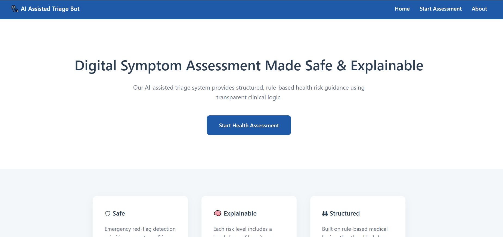
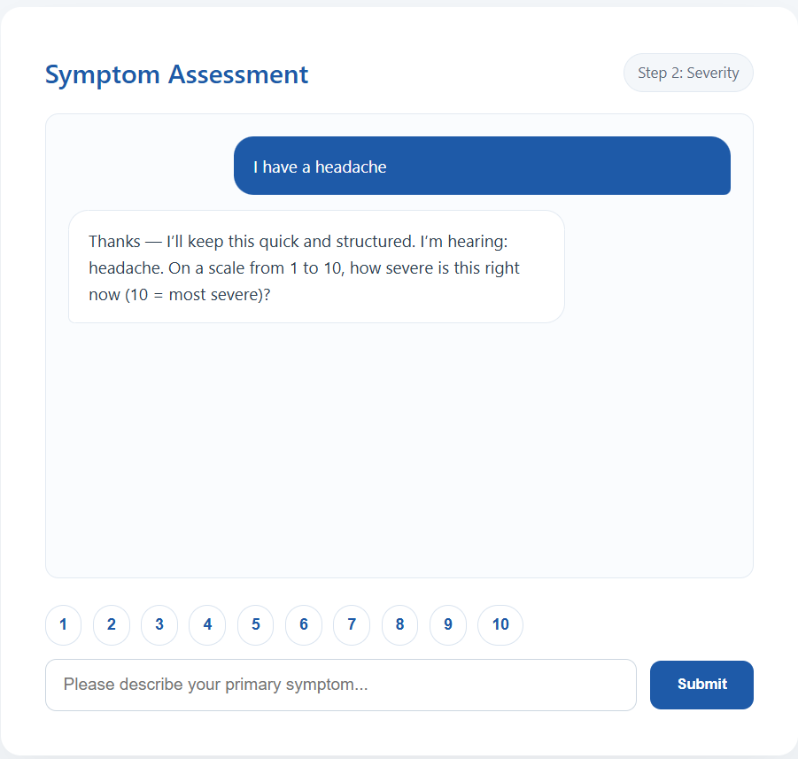
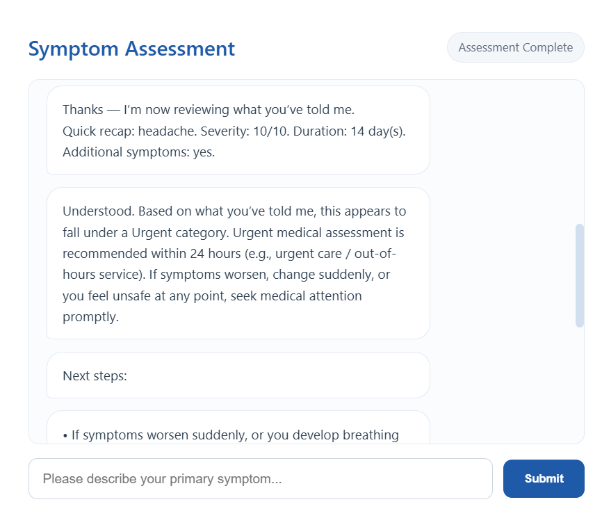
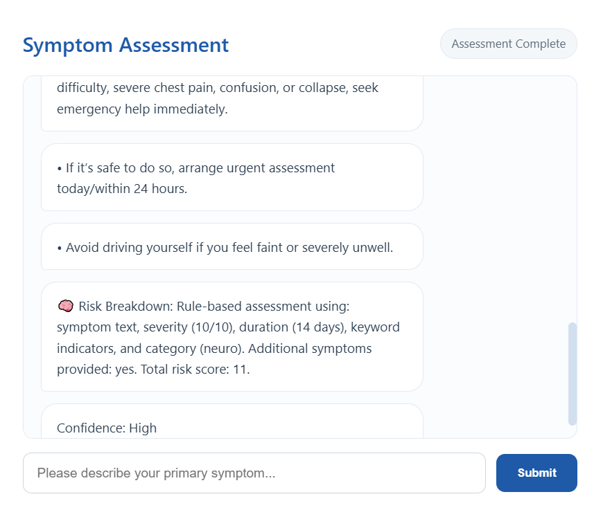

#  Explainable AI-Assisted Medical Triage Chatbot

An explainable, rule-based medical triage web application designed to assess user-reported symptoms, identify potential emergency warning signs and provide transparent urgency recommendations.

Developed as my final-year BSc (Hons) Computing project at Glasgow Caledonian University.

> **Important:** This application is an educational and research prototype. It is not a medical device and should not be used as a substitute for professional medical advice, diagnosis or emergency services.

---

##  Project Overview

Digital medical triage systems must balance usability with safety and explainability.

This project explores whether a lightweight, rule-based approach can provide structured and understandable triage guidance without relying on an opaque machine-learning model.

The application guides the user through a conversational symptom assessment and evaluates factors including:

* Primary symptoms
* Symptom severity
* Duration
* Associated symptoms
* Emergency red flags
* High-risk symptom combinations

Rather than simply returning a risk category, the system provides reasoning and recommended next steps to make its decision-making more transparent to the user.

##  Application Preview

### Landing Page

The application introduces the project and its focus on safe, structured and explainable digital triage.



### Interactive Symptom Assessment

Users complete a conversational assessment where the system collects symptom information, severity, duration and associated symptoms.



### Triage Recommendation

After processing the assessment, the system assigns an urgency category and provides appropriate next-step guidance.



### Explainable Risk Assessment

The system provides a transparent breakdown of the factors contributing to the result rather than presenting an unexplained classification.


---

##  Key Features

###  Emergency Red-Flag Detection

A dedicated emergency decision layer checks user input for potentially serious warning signs such as:

* Severe breathing difficulty
* Loss of consciousness or collapse
* Stroke-like symptoms
* Major bleeding
* Severe allergic reactions
* Cyanosis / blue lips

Certain symptoms are assessed contextually. For example, chest pain can trigger additional safety screening when high-risk features are not immediately present.

###  Structured Risk Scoring

The triage engine considers multiple pieces of information during an assessment, including:

* Symptom keywords
* Self-reported severity from 1–10
* Symptom duration
* Associated symptoms
* Worsening or persistent symptoms

The resulting score is mapped to an appropriate urgency level.

###  Explainable Recommendations

The system is designed around transparent decision-making.

Instead of presenting only an outcome, the chatbot can provide a breakdown explaining why the user's responses resulted in a particular risk classification.

###  Conversational Assessment

The interface provides a structured multi-step assessment while maintaining a chatbot-style interaction.

Quick-reply controls are provided for:

* Common symptoms
* Severity ratings
* Symptom duration
* Additional symptoms
* Safety questions

###  Session-Based Assessment

Each assessment maintains its own session state, allowing the system to track responses throughout the triage process.

Users can also restart the assessment and begin a new session.

###  Responsive Interface

The frontend is designed to work across desktop and smaller screen sizes, with a responsive assessment interface and conversational message layout.

---

##  System Architecture

```text
                    USER
                      │
                      ▼
             ┌─────────────────┐
             │   Web Interface │
             │ HTML / CSS / JS │
             └────────┬────────┘
                      │
                      │ POST /api/triage
                      ▼
             ┌─────────────────┐
             │ Express Router  │
             └────────┬────────┘
                      │
             ┌────────▼────────┐
             │ Emergency       │
             │ Red-Flag Check  │
             └────────┬────────┘
                      │
            ┌─────────┴─────────┐
            │                   │
       Emergency            Continue
            │                   │
            ▼                   ▼
      Immediate          ┌───────────────┐
      Escalation         │ Triage Engine │
                         └───────┬───────┘
                                 │
                     ┌───────────┼───────────┐
                     │           │           │
                  Severity    Duration    Symptoms
                     │           │           │
                     └───────────┼───────────┘
                                 ▼
                          ┌────────────┐
                          │ Risk Score │
                          └─────┬──────┘
                                ▼
                     ┌──────────────────┐
                     │ Recommendation   │
                     │ + Explanation    │
                     └──────────────────┘
```

---

## 🛠️ Technology Stack

### Backend

* Node.js
* Express.js
* JavaScript
* REST-style API

### Frontend

* HTML5
* CSS3
* Vanilla JavaScript
* Fetch API

### Development

* npm
* Git
* GitHub

---

##  Project Structure

```text
ai-medical-triage-chatbot/
│
├── engine/
│   ├── recommendation.js
│   ├── redFlags.js
│   └── riskScoring.js
│
├── public/
│   ├── about.html
│   ├── app.js
│   ├── index.html
│   ├── styles.css
│   └── triage.html
│
├── routes/
│   └── triage.js
│
├── .gitignore
├── package.json
├── package-lock.json
├── server.js
└── README.md
```

### `engine/`

Contains the core triage decision logic, including emergency detection, risk scoring and recommendation generation.

### `routes/`

Contains the Express API route responsible for passing user input through the emergency and triage engines.

### `public/`

Contains the browser-based user interface, styling and client-side application logic.

### `server.js`

Configures the Express server, serves the frontend and exposes the triage API.

---

##  Installation

### Prerequisites

You will need:

* Node.js
* npm
* Git

### 1. Clone the repository

```bash
git clone https://github.com/sjangx7/ai-medical-triage-chatbot.git
```

### 2. Enter the project directory

```bash
cd ai-medical-triage-chatbot
```

### 3. Install dependencies

```bash
npm install
```

### 4. Start the application

```bash
npm start
```

### 5. Open the application

Open the following address in your browser:

```text
http://localhost:3000
```

You can then begin a symptom assessment through the application.

---

##  How the Triage Process Works

A typical assessment follows this flow:

**1. Symptom Input**

The user describes their primary symptom.

**2. Safety Screening**

The input is checked for emergency red flags and potentially dangerous symptom combinations.

**3. Severity**

The user provides a severity rating between 1 and 10.

**4. Duration**

The system asks how long the symptoms have been present.

**5. Associated Symptoms**

Additional symptoms are collected to provide more context.

**6. Risk Assessment**

The collected information is processed by the rule-based scoring engine.

**7. Recommendation**

The system returns an urgency classification, explanation and suggested next steps.

---

##  Design Approach

This project intentionally uses a deterministic rule-based approach rather than a black-box predictive model.

This provides several advantages for a medical triage research prototype:

* Decisions can be traced back to explicit rules.
* Emergency conditions can be prioritised independently of general scoring.
* The reasoning behind recommendations can be presented to the user.
* Behaviour can be tested against predefined scenarios.
* Rules can be reviewed and modified without retraining a model.

The project therefore focuses on **explainability, safety and predictable behaviour** rather than attempting to provide medical diagnosis.

---

##  Safety & Limitations

This project is a **research and educational prototype only**.

It:

* Does not provide a medical diagnosis.
* Has not been validated for clinical deployment.
* Does not replace a doctor or qualified healthcare professional.
* Should not be relied upon during a medical emergency.
* Uses predefined rules and keyword interpretation rather than comprehensive clinical reasoning.

Real-world digital medical triage requires clinical validation, regulatory compliance, security controls and substantially more comprehensive testing before deployment.

---

## 🚀 Future Improvements

Potential future development could include:

* Expanded symptom and red-flag coverage
* Automated unit and integration testing
* Improved natural-language symptom interpretation
* Persistent but privacy-conscious session management
* Accessibility improvements
* More comprehensive clinical scenario validation
* Improved confidence and uncertainty communication
* Deployment using a secure cloud architecture

---

##  Author

**Sae Jang**

First-Class BSc (Hons) Computing Graduate
Glasgow Caledonian University

Interested in **Software Engineering, Artificial Intelligence, Cloud Development and Full-Stack Development**.

---

##  License

This project was developed for educational and research purposes.

Please review the project limitations before reusing any triage-related logic.
